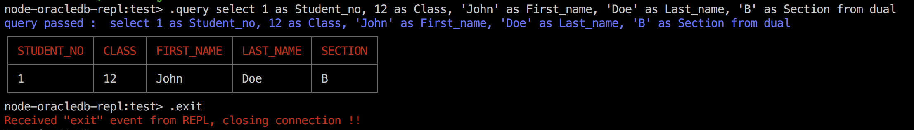

# node-oracledb-repl
NodeJs REPL for interacting with Oracle Database using "oracledb" npm module

# Setup
1. Clone repo - `$git clone git@github.com:hrmeetsingh/node-oracledb-repl.git`
2. `$cd node-oracledb-repl`
3. `$yarn`
4. Edit "configurations.json" to add oracledb credentials - *Host_ip, Sid, username, password*
5. Download zip from 'Instant client for Linux' for applicable OS [Instant client for Linux](https://www.oracle.com/database/technologies/instant-client/linux-x86-64-downloads.html#ic_x64_inst)
6. Unzip the downloaded zip into 'lib' folder and `export LD_LIBRARY_PATH="$(pwd)/lib"`
7. `$yarn setup:test` or `$yarn setup:dev`
8. `node-oracledb-repl> .query select 'Hello from oracle' from dual` (query withouts bounding quotes)
9. To exit REPL, `node-oracledb-repl>.exit`
